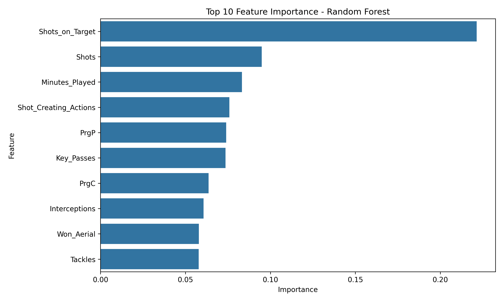

## Player Overperformance by Position 

### Overview

This project analyzes whether player overperformance can be predicted using machine learning, incorporating both player behavior and positional context.

Overperformance is defined as scoring more goals than expected (based on xG). The goal is to identify patterns that help detect players who exceed expectations — a valuable use case in scouting and recruitment.

### Objective

Build a binary classification model to predict whether a player:

- **1 = Overperformed (Goals > xG)**
- **0 = Did not overperform**

### Dataset

The dataset includes player-level statistics such as:

- Playing time (minutes, starts)  
- Shooting activity (shots, shots on target)  
- Chance creation (key passes, shot-creating actions)  
- Progression (progressive passes and carries)  
- Defensive contribution (tackles, interceptions, aerial duels)  
- Position  

Goalkeepers and players with xG = 0 were excluded to ensure meaningful evaluation.

## Methodology

### 1. Data preparation
- Removed players with xG = 0  
- Cleaned positional data  
- Excluded goalkeeper-specific features  
- Created efficiency metric and binary target  

### 2. Feature selection
Features were selected to:
- Avoid data leakage  
- Represent player behavior  
- Include positional context  

### 3. Modeling
Two models were trained and evaluated:

- Logistic Regression (baseline)  
- Random Forest (final model)  

A preprocessing pipeline was used to:
- Encode categorical variables (position)  
- Scale numerical features  

### 4. Threshold tuning
The classification threshold was adjusted from 0.5 to 0.4 to improve recall and better capture overperforming players.

### Results

### Logistic Regression (threshold = 0.4)
- Precision: 0.66  
- Recall: 0.46  
- F1 Score: 0.54  
- ROC-AUC: 0.73  

### Random Forest (threshold = 0.4)
- Precision: 0.53  
- Recall: 0.59  
- F1 Score: 0.56  
- ROC-AUC: 0.72  

### Final Model

**Random Forest** was selected due to its higher recall and better F1 score, making it more suitable for identifying potential overperformers.

### Key Insights

- Shooting-related metrics, especially **shots on target**, are the strongest predictors of overperformance  
- Player involvement in attacking actions is more important than positional label alone  
- While position adds context, **on-field behavior is the primary driver of overperformance**  

### Visualization

### Business Value

This model can support:

- Scouting and recruitment decisions  
- Player performance evaluation  
- Identification of undervalued players  

By focusing on recall, the model prioritizes identifying potential high-performing players, even at the cost of some false positives.

### Limitations

- Single-season dataset  
- Potential feature redundancy  
- Excludes goalkeepers  

### Future Work

- Incorporate multi-season data  
- Build position-specific models  
- Explore model calibration and threshold optimization  
- Add more advanced metrics  

### Tech Stack

- Python  
- Pandas  
- Scikit-learn  
- Matplotlib / Seaborn  

### Author

Gabriela Cardenas  
Aspiring Data Scientist focused on Sports Analytics 